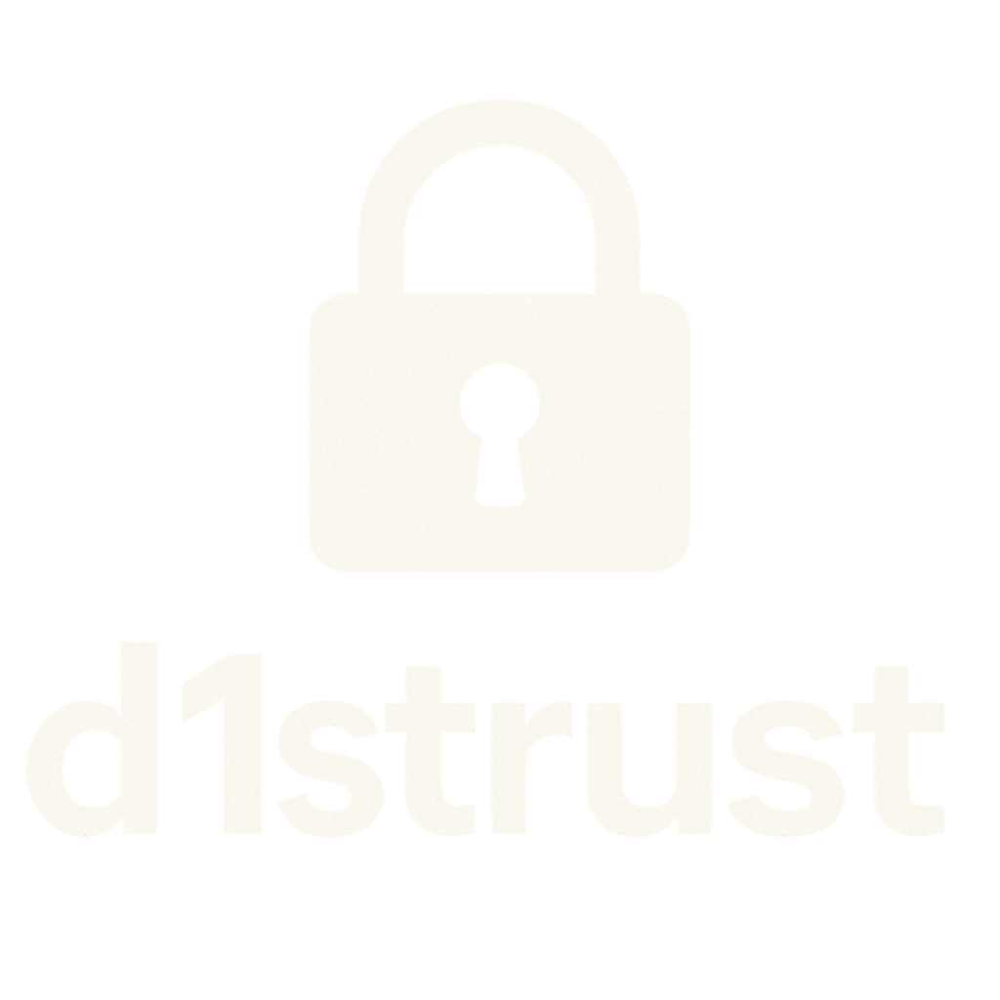

<div align="center">
  
</div>

# d1strust

A zero-knowledge one-time secret sharing service. Share secrets that self-destruct, with encryption that happens entirely client-side. Even if someone compromises the server, they can't decrypt your secrets—the keys never leave your browser.

**Live:** [ots.cachevalley.co](https://ots.cachevalley.co) | **Repo:** [github.com/CacheValleyCommunities/d1strust](https://github.com/CacheValleyCommunities/d1strust)

## What it does

You encrypt a secret in your browser, send the encrypted blob to the server, get back a URL with the decryption key in the query parameter. The server never sees your plaintext or your encryption key. When someone opens the URL, they decrypt it client-side and optionally the secret gets deleted.

It's basically a pastebin that actually respects your privacy.

## Why this exists

Most "secure" secret sharing services store your data encrypted at rest, but they can still decrypt it. That means if their database gets compromised, so does your secret. This one can't decrypt your secrets even if you hand over the database and server access—the keys are only in the URLs you share.

## Quick start

You'll need [Bun](https://bun.sh) installed.

```bash
git clone https://github.com/CacheValleyCommunities/d1strust.git
cd d1strust
bun install
```

Create a `.env` file (or just export the variables):

```bash
DB_ENCRYPTION_KEY=your-minimum-8-character-key-here
```

Run it:

```bash
bun run dev
```

Open `http://localhost:3000` and you're good to go.

## Docker

Build the image:

```bash
docker build -t d1strust-ots .
```

Run it:

```bash
docker run -d \
  --name d1strust-ots \
  -p 3000:3000 \
  -e DB_ENCRYPTION_KEY="your-encryption-key-min-8-chars" \
  -e BASE_URL="https://your-domain.com" \
  -e PORT=3000 \
  -v d1strust-data:/app/data \
  d1strust-ots
```

The `BASE_URL` should be your public domain (with https) so generated links work correctly. The volume stores the SQLite database—make sure it's backed up if you care about the data.

### Environment variables

- `DB_ENCRYPTION_KEY` (required) - At least 8 characters. Used for application-level database encryption (AES-256-CBC). Don't lose this or you can't decrypt existing secrets.
- `BASE_URL` (optional) - Public URL for generated links. Defaults to relative URLs if not set.
- `PORT` (optional) - Server port. Defaults to 3000.
- `DB_PATH` (optional) - SQLite database path. Defaults to `/app/data/ots.db` in Docker, `./data/ots.db` locally.

## How it works

### Encryption flow

1. Browser generates a random 256-bit key
2. Secret gets encrypted with AES-256-CBC using that key
3. If you set a password, it's encrypted twice: first with the password (PBKDF2-SHA1, 10k iterations), then with the random key
4. Only the encrypted blob, IV, salt, and metadata go to the server
5. Server stores it indexed by a ULID it generates (completely unrelated to your encryption key)
6. Server returns the ULID, you construct the URL: `/s/{ulid}?key={yourEncryptionKey}`

The server never sees your encryption key. It's only in the URL query parameter, which we explicitly strip from logs.

### What gets stored

The server stores:
- Encrypted ciphertext (can't decrypt without the key)
- IVs and salts
- KDF parameters
- Metadata (expiration, read counts, etc.)

The server never sees:
- Plaintext secrets
- Encryption keys
- Passwords
- Decrypted data

Even if someone steals the database, they get encrypted blobs with no way to decrypt them without the keys in your URLs.

### Database encryption

Since Bun's SQLite doesn't support SQLCipher, we do application-level encryption. Sensitive fields (ciphertext, IVs, salts, password hashes, metadata) are encrypted with AES-256-CBC before hitting the database. Each value gets its own salt and IV, derived from `DB_ENCRYPTION_KEY` using PBKDF2-SHA256 (100k iterations).

It's not perfect (someone with database access could still see the schema and some metadata), but it's better than plaintext and works with what we have.

## API

There's a Swagger UI at `/docs` when the server is running. Basic endpoints:

**Create a secret:**
```bash
POST /api/v1/ots/
Content-Type: application/json

{
  "ciphertext": "base64_encrypted_data",
  "iv": "hex_iv",
  "salt": "hex_salt",
  "kdf": "pbkdf2",
  "kdfParams": {"iterations": 10000, "isPasswordProtected": false},
  "burnAfterRead": true,
  "expiresIn": "24h"
}
```

Returns the server-generated ID and a retrieve URL. You append `?key={yourEncryptionKey}` to that URL.

**Retrieve a secret:**
```bash
GET /api/v1/ots/:id
```

The `?key=` parameter is ignored server-side (we never read it). Returns the encrypted data blob for client-side decryption.

**Delete a secret:**
```bash
DELETE /api/v1/ots/:id
```

Permanently removes it from the database.

## CLI

There's a Go CLI in the `cli/` directory. See [cli/README.md](cli/README.md) for setup and usage.

Quick example:
```bash
# Create a secret
echo "my secret" | ots create --burn-after-read

# Redeem it
ots redeem "http://localhost:3000/s/01ABC123...?key=def456..."
```

## Development

Run tests:
```bash
bun test
```

Project structure is pretty straightforward:
- `src/` - TypeScript server code (Fastify + Drizzle ORM)
- `public/` - HTML/JS frontend (vanilla, no framework)
- `cli/` - Go CLI tool
- `drizzle/` - Database migrations

The codebase is documented. Read the source if you want to understand the details.

## Security

If you find a vulnerability, email [security@cachevalley.co](mailto:security@cachevalley.co). Include details, steps to reproduce, impact, and any fixes you've thought of. We'll coordinate disclosure responsibly.

## License

MIT License. See [LICENSE](LICENSE) for details.

## Attribution

Use this in your projects if you want. Just link back to:
- This repo: [github.com/CacheValleyCommunities/d1strust](https://github.com/CacheValleyCommunities/d1strust)
- Cache Valley Communities: [cachevalley.co](https://cachevalley.co)

Thanks for respecting the open source community.
git a